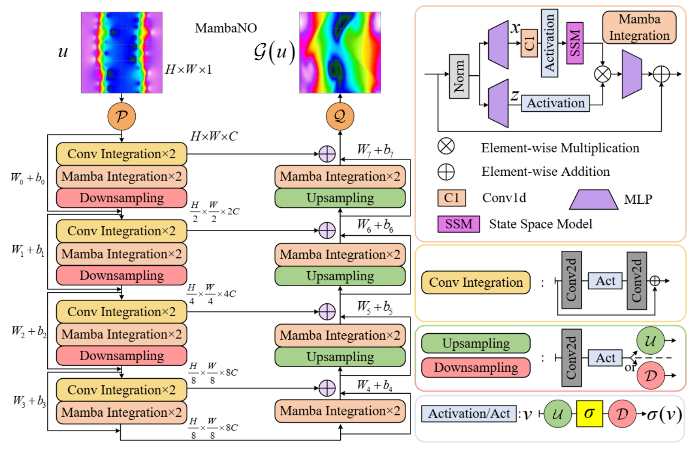
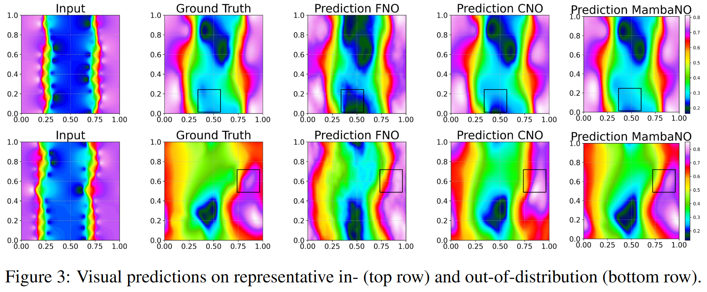

<div align="center">
<h1>Mamba-Neural-Operator</h1>
<h3>Alias-Free Mamba Neural Operator</h3>

[Jianwei Zhen](https://zhengjianwei2.github.io/)<sup>1</sup> ,[Wei Li]()<sup>1</sup>,[Ni Xu]()<sup>1</sup>, [Junwei Zhu]()<sup>1</sup>, [Xiaoxu Lin]()<sup>1</sup>, [Xiaoqin Zhang]()<sup>1 :email:</sup>

<sup>1</sup>  Zhejiang University of Technology

(<sup>:email:</sup>) corresponding author.

NeurIPS 2025 ([conference paper](https://proceedings.neurips.cc/paper_files/paper/2024/hash/5ee553ec47c31e46a1209bb858b30aa5-Abstract-Conference.html))

</div>

## Abstract
Benefiting from the booming deep learning techniques, neural operators (NO) are considered as an ideal alternative to break the traditions of solving Partial Differential Equations (PDE) with expensive cost.
Yet with the remarkable progress, current solutions concern little on the holistic function features--both global and local information-- during the process of solving PDEs.
Besides, a meticulously designed kernel integration to meet desirable performance often suffers from a severe computational burden, such as GNO with $O(N(N-1))$, FNO with $O(NlogN)$, and Transformer-based NO with $O(N^2)$.
To counteract the dilemma, we propose a mamba neural operator with $O(N)$ computational complexity, namely MambaNO.
Functionally, MambaNO achieves a clever balance between global integration, facilitated by state space model of Mamba that scans the entire function, and local integration, engaged with an alias-free architecture. We prove a property of continuous-discrete equivalence to show the capability of
MambaNO in approximating operators arising from universal PDEs to desired accuracy. MambaNOs are evaluated on a diverse set of benchmarks with possibly multi-scale solutions and set new state-of-the-art scores, yet with fewer parameters and better efficiency.

## Overview
<div align="center">

</div>

## PDE Visualization
<div align="center">

</div>

## Datasets💾 

Alternatively, you can run the `download_data.py` script to download all required data into the appropriate folder.

**Note:** This script requires `wget` to be installed on your system.

```bash
python3 download_data.py
```

## Train & Test


## Acknowledgement :heart:
This project is based on CNO ([paper](https://arxiv.org/pdf/2302.01178), [code](https://github.com/camlab-ethz/ConvolutionalNeuralOperator)), VM-UNet ([paper](https://arxiv.org/abs/2402.02491), [code](https://github.com/JCruan519/VM-UNet)). Thanks for their wonderful works.

## Citation
If you find Mamba Neural Operator is useful in your research or applications, please consider giving us a star 🌟 and citing it by the following BibTeX entry.

```bibtex
@inproceedings{NEURIPS2024_5ee553ec,
 author = {Zheng, Jianwei and Li, Wei and Xu, Ni and Zhu, Junwei and Lin, Xiaoxu and Zhang, Xiaoqin},
 booktitle = {Advances in Neural Information Processing Systems},
 editor = {A. Globerson and L. Mackey and D. Belgrave and A. Fan and U. Paquet and J. Tomczak and C. Zhang},
 pages = {52962--52995},
 publisher = {Curran Associates, Inc.},
 title = {Alias-Free Mamba Neural Operator},
 url = {https://proceedings.neurips.cc/paper_files/paper/2024/file/5ee553ec47c31e46a1209bb858b30aa5-Paper-Conference.pdf},
 volume = {37},
 year = {2024}
}

```


